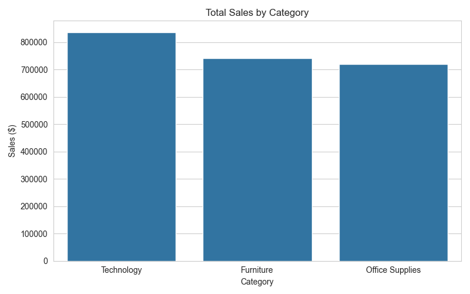
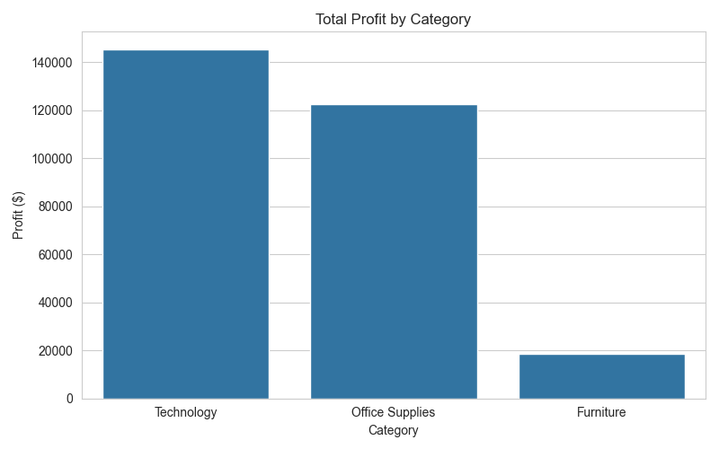
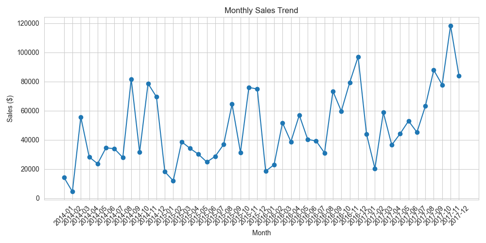
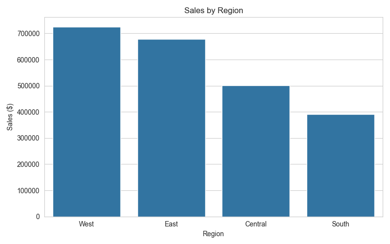

# Retail Sales Data Analysis

This project analyses a retail sales dataset using Python, Pandas, Matplotlib, and Seaborn to identify sales trends, profit patterns, and business insights.

## Key Insights

• Technology generated the highest overall sales  
• Technology also produced the strongest profit margins  
• The West region achieved the highest sales performance  
• Monthly sales patterns show fluctuations that could reflect seasonal demand

## Tools Used

Python  
Pandas  
Matplotlib  
Seaborn  

## Visualisations

